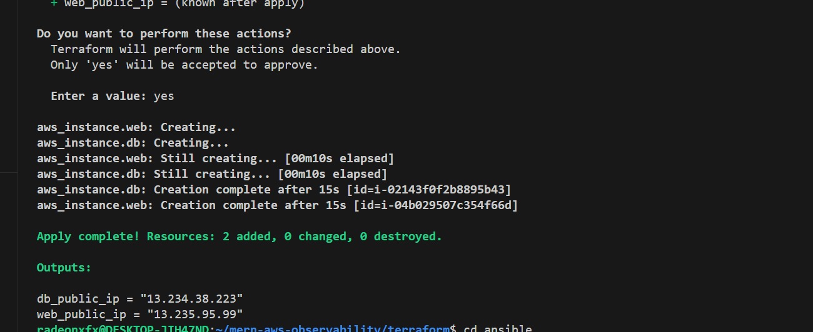
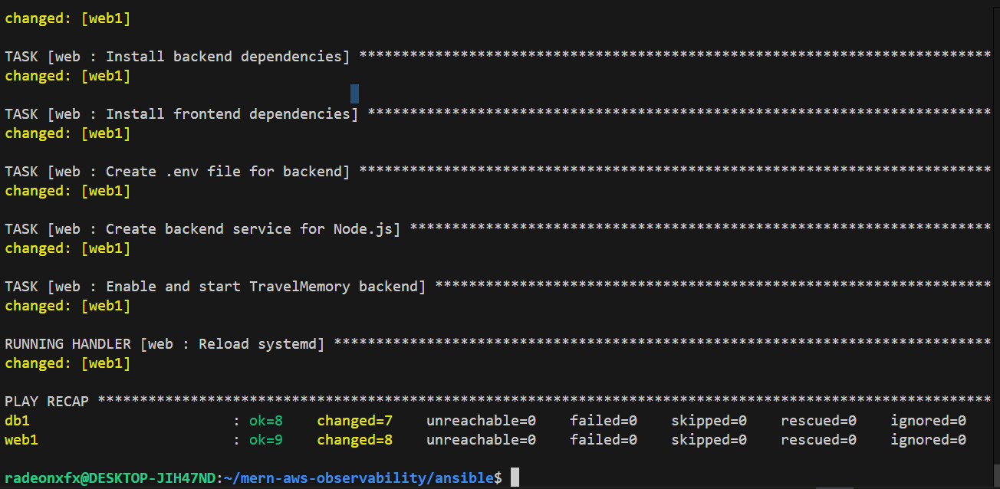
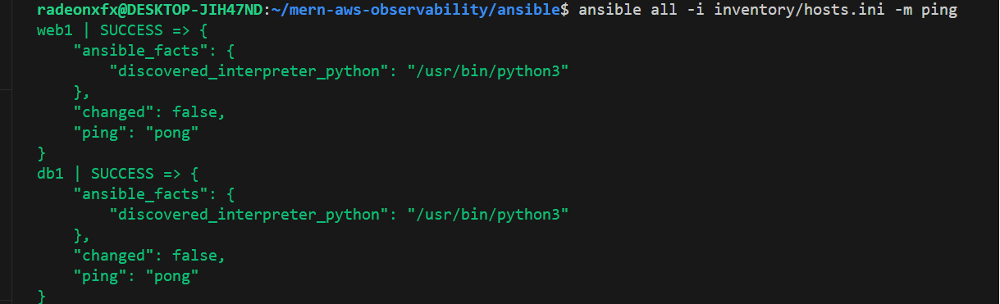

---

# 📘 Deployment Documentation: MERN Application on AWS (Terraform + Ansible)

---

## 1. Prerequisites

* AWS account with EC2, VPC, and IAM access.
* Terraform installed (`terraform -v`).
* Ansible installed (`ansible --version`).
* Download AWS SSH key (`prince-pair-x-2.pem`) and place it in **home directory**:

  ```bash
  ~/prince-pair-x-2.pem
  ```

  Set correct permissions:

  ```bash
  chmod 400 ~/prince-pair-x-2.pem
  ```

---

## 2. Provisioning Infrastructure with Terraform

1. Navigate to Terraform directory:

   ```bash
   cd mern-aws-observability/terraform
   ```

2. Initialize Terraform:

   ```bash
   terraform init
   ```

3. Apply Terraform to create the infrastructure:

   ```bash
   terraform apply -auto-approve
   ```



   ✅ This creates **two EC2 instances**:

   * **DB Instance** (MongoDB server)
   * **Web Instance** (Node.js backend + frontend)

4. Terraform outputs the **Public IPs** for both instances.

---

## 3. Configuring Instances with Ansible

After Terraform creates the infrastructure, use Ansible to configure MongoDB and deploy the app:

Run the following command:

```bash
ansible-playbook -i inventory/hosts.ini site.yml
```




This step:

* Installs and starts **MongoDB** on DB instance.
* Installs **Node.js**, clones the app repo, installs dependencies on Web instance.
* Creates the required `.env` file dynamically with DB IP and app port.
* Ensures MongoDB service is running and backend server is ready.

---

## 4. Verifying Deployment

### MongoDB

On the DB instance:

```bash
sudo systemctl status mongod
```

You should see it **running**.

### Backend

On the Web instance:

```bash
cd ~/TravelMemory/backend
node index.js
```

Expected log:

```
Server started at http://localhost:3001
MongoDB Connected...
```

Verify in browser:

```
http://<web_public_ip>:3001/hello
```

Response:

```
Hello World!
```

---

## 5. Final Notes

* The `.pem` file must always be in the home directory before Terraform/Ansible steps.

* Order of execution:

  1. `terraform init`
  2. `terraform apply -auto-approve`
  3. `ansible-playbook -i inventory/hosts.ini site.yml`

* After these steps, both MongoDB and the backend are deployed successfully.

---


