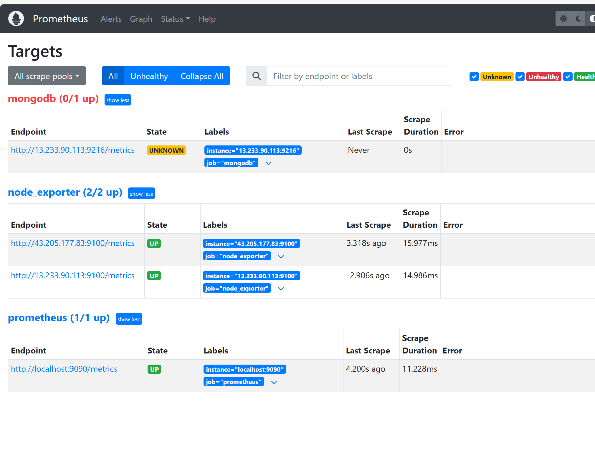
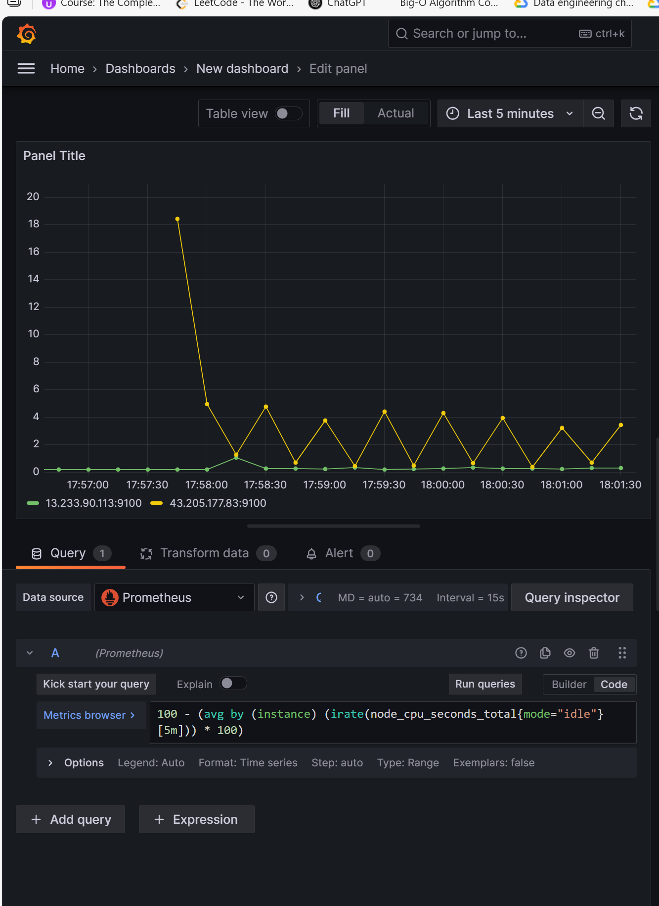

---

# 📘 Deployment & Observability of MERN Application on AWS (Terraform + Ansible + Prometheus + Grafana)

---

## 1. 🚀 Prerequisites

Before starting, ensure you have:

* AWS account with **EC2, VPC, and IAM** permissions
* **Terraform** installed → `terraform -v`
* **Ansible** installed → `ansible --version`
* AWS SSH key (example: `prince-pair-x-2.pem`) stored in home directory:

  ```bash
  ~/prince-pair-x-2.pem
  chmod 400 ~/prince-pair-x-2.pem
  ```

---

## 2. 🏗️ Provision Infrastructure with Terraform

1. Navigate to Terraform code:

   ```bash
   cd mern-aws-observability/terraform
   ```

2. Initialize Terraform:

   ```bash
   terraform init
   ```

3. Apply Terraform to provision infrastructure:

   ```bash
   terraform apply -auto-approve
   ```

   ✅ This creates:

   * **DB Instance** → MongoDB server
   * **Web Instance** → Node.js backend + frontend
   * Security groups and networking

4. Terraform outputs **public IPs** of both instances. Save them for later use.

📸 Example:


---

## 3. ⚙️ Configure with Ansible

Once infra is ready, use Ansible for provisioning:

Run:

```bash
ansible-playbook -i inventory/hosts.ini site.yml
```

📸 Example Run:


This playbook:

* Installs & starts **MongoDB** on DB instance
* Installs **Node.js** + dependencies on Web instance
* Clones **TravelMemory** GitHub repo
* Creates `.env` with DB IP & backend port
* Configures **systemd service** for backend
* Installs **Prometheus**, **Node Exporter**, **MongoDB Exporter**
* Installs **Grafana** for dashboards

---

## 4. ✅ Verifying Deployment

### MongoDB (on DB instance)

```bash
sudo systemctl status mongod
```

You should see **active (running)**.

### Backend (on Web instance)

```bash
sudo systemctl status travelmemory
```

You should see it running on port **3001**.

Verify:

```
http://<web_public_ip>:3001/hello
```

Expected response:

```
Hello World!
```

---

## 5. 📊 Observability Setup

### Prometheus

* Service check:

  ```bash
  sudo systemctl status prometheus
  ```
* UI:

  ```
  http://<web_public_ip>:9090/targets
  ```
* Expected: Prometheus, Node Exporter, MongoDB Exporter should show `UP`.




### Grafana

* Service check:

  ```bash
  sudo systemctl status grafana-server
  ```
* UI:

  ```
  http://<web_public_ip>:3000
  ```

  Default login: `admin / admin` (prompted to change)

---

## 6. 🔎 Sample Prometheus Queries (to test in Grafana)

* **Exporter health**

  ```promql
  up
  ```

* **CPU Usage (%)**

  ```promql
  100 - (avg by (instance) (irate(node_cpu_seconds_total{mode="idle"}[5m])) * 100)
  ```

* **Memory Usage (%)**

  ```promql
  100 * (1 - (node_memory_MemAvailable_bytes / node_memory_MemTotal_bytes))
  ```

* **Disk Usage (%)**

  ```promql
  100 - (node_filesystem_avail_bytes{mountpoint="/"} * 100 / node_filesystem_size_bytes{mountpoint="/"})
  ```

* **Network RX/TX**

  ```promql
  irate(node_network_receive_bytes_total[5m])
  irate(node_network_transmit_bytes_total[5m])
  ```

* **MongoDB**

  ```promql
  mongodb_up
  mongodb_connections
  ```

---



## 7. 📌 Order of Execution

1. Terraform → Provision infra

   ```bash
   terraform init
   terraform apply -auto-approve
   ```

2. Ansible → Configure infra

   ```bash
   ansible-playbook -i inventory/hosts.ini site.yml
   ```

3. Verify services

   * MongoDB
   * Backend API
   * Prometheus
   * Grafana

---

## 8. 📝 Notes

* Ensure `.pem` key is in home directory before provisioning
* Use **`systemctl`** to check/start/stop services
* Use Grafana dashboards for visualization & alerts

---

✅ At the end of this assignment:

* MERN backend deployed on AWS EC2
* MongoDB running on dedicated instance
* Observability enabled with **Prometheus + Node Exporter + MongoDB Exporter + Grafana**

---


